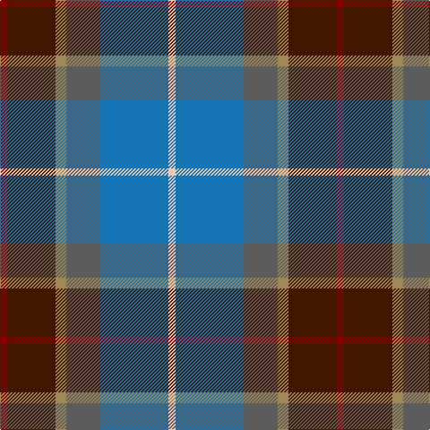

The parent of this is [State Seal of Michigan (Fashion)](/tartans/dra/8/dr54/lt12/n38/b76/lr/8/)

This was sourced from tartans-authority.  It is a [6 stripes tartan](/stripes/stripes6/).

Original link http://www.tartansauthority.com/tartan-ferret/display/8636/

## Thread count
DRa/8 DR54 LT12 N38 B76 LR/8

## Palette
Each colour and its ΔE from the base-6 reference it is a variant of.

| Colour | Shade | Base | ΔE (OKLab) |
|---|---|---|---|
| B |  `#1474B4` | B  | 0.15 |
| DR |  `#441800` | B  | 0.22 |
| DRa |  `#880000` | R  | 0.14 |
| LR |  `#E8CCB8` | W  | 0.11 |
| LT |  `#A08858` | Y  | 0.21 |
| N |  `#5C5C5C` | B  | 0.14 |

# Sample pattern

ID: /variants/dra/8/dr54/lt12/n38/b76/lr/8-b1474b4-dr441800-dra880000-lre8ccb8-lta08858-n5c5c5c/
