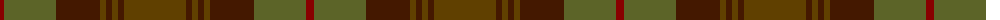
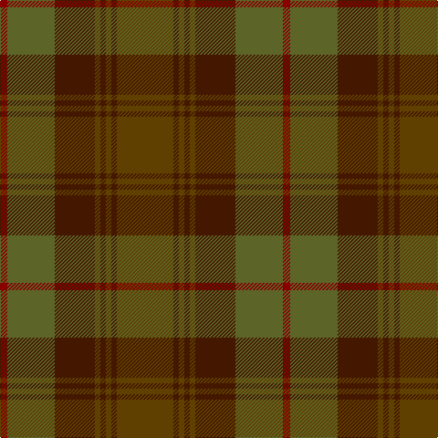

The parent of this is [Devarr (Fashion)](/tartans/dra/8/g52/dr44/t6/dr6/t6/dr6/t/62/)

This was sourced from tartans-authority.  It is a [8 stripes tartan](/stripes/stripes8/).

Original link http://www.tartansauthority.com/tartan-ferret/display/3945/

## Thread count
DRa/8 G52 DR44 T6 DR6 T6 DR6 T/62

## Palette
Each colour and its ΔE from the base-6 reference it is a variant of.

| Colour | Shade | Base | ΔE (OKLab) |
|---|---|---|---|
| DR |  `#441800` | B  | 0.22 |
| DRa |  `#880000` | R  | 0.14 |
| G |  `#5C6428` | G  | 0.09 |
| T |  `#604000` | G  | 0.14 |

# Sample pattern

ID: /variants/dra/8/g52/dr44/t6/dr6/t6/dr6/t/62-dr441800-dra880000-g5c6428-t604000/
