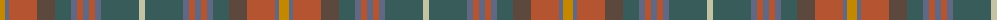

The parent of this is [Meath Irish County Tartan Tartan Number: 2269. Earliest known date: 1996 One of a series of Irish District tartans designed by Polly Wittering of the House of Edgar, with colours reminiscent of the Country with soft warm colours dominating. See products available Copyright © Blair Urquhart, Comrie, 2015](/tartans/dy/10/b4/lt28/na18/n16/b6/lt6/b6/lt6/b6/n38/nb/6/)

This was sourced from house-of-tartan.  It is a [12 stripes tartan](/stripes/stripes12/).

Original link http://www.house-of-tartan.scotland.net/house/TartanViewjs.asp?colr=Def&tnam=2269

## Thread count
DY/10 B4 LT28 Na18 N16 B6 LT6 B6 LT6 B6 N38 Nb/6

## Palette
Each colour and its ΔE from the base-6 reference it is a variant of.

| Colour | Shade | Base | ΔE (OKLab) |
|---|---|---|---|
| B |  `#606884` | B  | 0.15 |
| DY |  `#C48800` | Y  | 0.16 |
| LT |  `#B45430` | R  | 0.09 |
| N |  `#385C59` | G  | 0.12 |
| Na |  `#5C483C` | B  | 0.15 |
| Nb |  `#C4C4A4` | Y  | 0.13 |

ID: /variants/dy/10/b4/lt28/na18/n16/b6/lt6/b6/lt6/b6/n38/nb/6-b606884-dyc48800-ltb45430-n385c59-na5c483c-nbc4c4a4/
