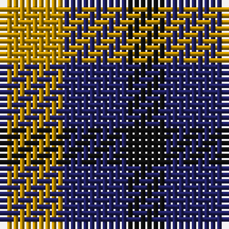

The parent of this is [Kazakhstan Relic (Artefact)](/tartans/dy/10/db10/k/6/)

This was sourced from tartans-authority.  It is a [3 stripes tartan](/stripes/stripes3/).

Original link http://www.tartansauthority.com/tartan-ferret/display/3096/

## Thread count
DY/10 DB10 K/6

## Palette
Each colour and its ΔE from the base-6 reference it is a variant of.

| Colour | Shade | Base | ΔE (OKLab) |
|---|---|---|---|
| DB |  `#202060` | B  | 0.11 |
| DY |  `#BC8C00` | Y  | 0.16 |
| K |  `#101010` | K  | 0.17 |

# Sample pattern

ID: /variants/dy/10/db10/k/6-db202060-dybc8c00-k101010/
