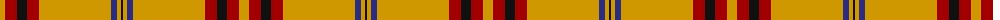

The parent of this is [Lermontov Bicentenary](/tartans/dy/10/dr12/k10/dr12/dy72/db6/dy4/k/2/)

This was sourced from tartans-authority.  It is a [8 stripes tartan](/stripes/stripes8/).

Original link http://www.tartansauthority.com/tartan-ferret/display/11000/

## Thread count
DY/10 DR12 K10 DR12 DY72 DB6 DY4 K/2

## Palette
Each colour and its ΔE from the base-6 reference it is a variant of.

| Colour | Shade | Base | ΔE (OKLab) |
|---|---|---|---|
| DB |  `#2C2C80` | B  | 0.05 |
| DR |  `#A00000` | R  | 0.09 |
| DY |  `#D09800` | Y  | 0.11 |
| K |  `#101010` | K  | 0.17 |

# Sample pattern

ID: /variants/dy/10/dr12/k10/dr12/dy72/db6/dy4/k/2-db2c2c80-dra00000-dyd09800-k101010/
