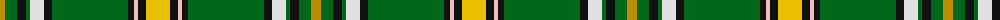

The parent of this is [Offally County Crest (Fashion)](/tartans/dy/10/g12/k9/g4/ln14/k8/g76/k6/lr4/k8/y/24/)

This was sourced from tartans-authority.  It is a [11 stripes tartan](/stripes/stripes11/).

Original link http://www.tartansauthority.com/tartan-ferret/display/7456/

## Thread count
DY/10 G12 K9 G4 LN14 K8 G76 K6 LR4 K8 Y/24

## Palette
Each colour and its ΔE from the base-6 reference it is a variant of.

| Colour | Shade | Base | ΔE (OKLab) |
|---|---|---|---|
| DY |  `#BC8C00` | Y  | 0.16 |
| G |  `#006818` | G  | 0.02 |
| K |  `#101010` | K  | 0.17 |
| LN |  `#E0E0E0` | W  | 0.06 |
| LR |  `#F0BCBC` | W  | 0.14 |
| Y |  `#E8C000` | Y  | 0.00 |

ID: /variants/dy/10/g12/k9/g4/ln14/k8/g76/k6/lr4/k8/y/24-dybc8c00-g006818-k101010-lne0e0e0-lrf0bcbc-ye8c000/
