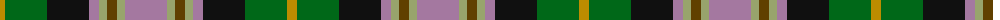

The parent of this is [Labrador Club of Scotland (Corporate](/tartans/dy/10/g42/k42/lp10/lt8/t10/lt8/lp/42/)

This was sourced from tartans-authority.  It is a [8 stripes tartan](/stripes/stripes8/).

Original link http://www.tartansauthority.com/tartan-ferret/display/8262/

## Thread count
DY/10 G42 K42 LP10 LT8 T10 LT8 LP/42

## Palette
Each colour and its ΔE from the base-6 reference it is a variant of.

| Colour | Shade | Base | ΔE (OKLab) |
|---|---|---|---|
| DY |  `#BC8C00` | Y  | 0.16 |
| G |  `#006818` | G  | 0.02 |
| K |  `#101010` | K  | 0.17 |
| LP |  `#A478A0` | R  | 0.22 |
| LT |  `#98A46C` | Y  | 0.16 |
| T |  `#604000` | G  | 0.14 |

# Sample pattern

ID: /variants/dy/10/g42/k42/lp10/lt8/t10/lt8/lp/42-dybc8c00-g006818-k101010-lpa478a0-lt98a46c-t604000/
