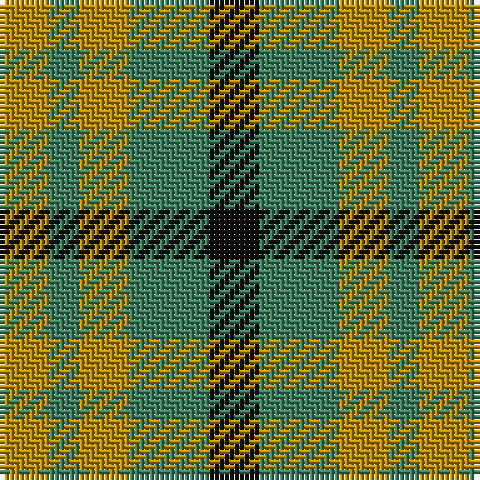

The parent of this is [Angle Dress (Fashion)](/tartans/dy/10/g6/dy10/g16/k/10/)

This was sourced from tartans-authority.  It is a [5 stripes tartan](/stripes/stripes5/).

Original link http://www.tartansauthority.com/tartan-ferret/display/3513/

## Thread count
DY/10 G6 DY10 G16 K/10

## Palette
Each colour and its ΔE from the base-6 reference it is a variant of.

| Colour | Shade | Base | ΔE (OKLab) |
|---|---|---|---|
| DY |  `#BC8C00` | Y  | 0.16 |
| G |  `#408060` | G  | 0.13 |
| K |  `#101010` | K  | 0.17 |

# Sample pattern

ID: /variants/dy/10/g6/dy10/g16/k/10-dybc8c00-g408060-k101010/
