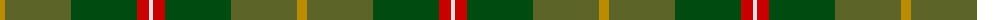
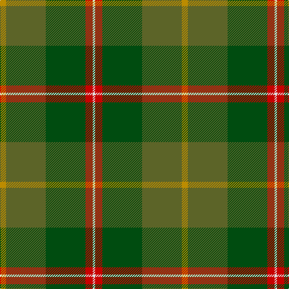

The parent of this is [Symington (Name)](/tartans/dy/10/g66/ga66/r12/ln/4/)

This was sourced from tartans-authority.  It is a [5 stripes tartan](/stripes/stripes5/).

Original link http://www.tartansauthority.com/tartan-ferret/display/7178/

## Thread count
DY/10 G66 Ga66 R12 LN/4

## Palette
Each colour and its ΔE from the base-6 reference it is a variant of.

| Colour | Shade | Base | ΔE (OKLab) |
|---|---|---|---|
| DY |  `#BC8C00` | Y  | 0.16 |
| G |  `#5C6428` | G  | 0.09 |
| Ga |  `#004C10` | G  | 0.08 |
| LN |  `#E0E0E0` | W  | 0.06 |
| R |  `#C80000` | R  | 0.00 |

# Sample pattern

ID: /variants/dy/10/g66/ga66/r12/ln/4-dybc8c00-g5c6428-ga004c10-lne0e0e0-rc80000/
