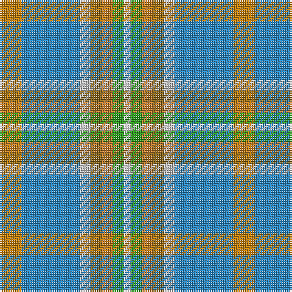

The parent of this is [Atikokan (District)](/tartans/dy/12/b32/n6/t6/do6/g6/w/4/)

This was sourced from tartans-authority.  It is a [7 stripes tartan](/stripes/stripes7/).

Original link http://www.tartansauthority.com/tartan-ferret/display/2596/

## Thread count
DY/12 B32 N6 T6 DO6 G6 W/4

## Palette
Each colour and its ΔE from the base-6 reference it is a variant of.

| Colour | Shade | Base | ΔE (OKLab) |
|---|---|---|---|
| B |  `#2888C4` | B  | 0.21 |
| DO |  `#C47C2C` | R  | 0.18 |
| DY |  `#C48008` | Y  | 0.18 |
| G |  `#289C18` | G  | 0.18 |
| N |  `#C0C0C0` | W  | 0.16 |
| T |  `#886414` | G  | 0.16 |
| W |  `#FCFCFC` | W  | 0.03 |

# Sample pattern

ID: /variants/dy/12/b32/n6/t6/do6/g6/w/4-b2888c4-doc47c2c-dyc48008-g289c18-nc0c0c0-t886414-wfcfcfc/
