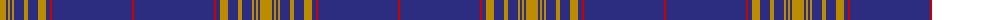

The parent of this is [Angotta (Name)](/tartans/dy/12/db2/dy2/db2/dy2/db10/dy4/db10/dy8/db4/r2/db80/r/2/)

This was sourced from tartans-authority.  It is a [13 stripes tartan](/stripes/stripes13/).

Original link http://www.tartansauthority.com/tartan-ferret/display/10038/

## Thread count
DY/12 DB2 DY2 DB2 DY2 DB10 DY4 DB10 DY8 DB4 R2 DB80 R/2

## Palette
Each colour and its ΔE from the base-6 reference it is a variant of.

| Colour | Shade | Base | ΔE (OKLab) |
|---|---|---|---|
| DB |  `#2C2C80` | B  | 0.05 |
| DY |  `#BC8C00` | Y  | 0.16 |
| R |  `#C80000` | R  | 0.00 |

ID: /variants/dy/12/db2/dy2/db2/dy2/db10/dy4/db10/dy8/db4/r2/db80/r/2-db2c2c80-dybc8c00-rc80000/
