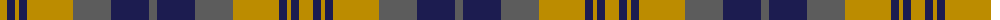

The parent of this is [Chindecella Gorse (Personal)](/tartans/dy/14/db8/dy4/db8/dy46/n38/db38/n/8/)

This was sourced from tartans-authority.  It is a [8 stripes tartan](/stripes/stripes8/).

Original link http://www.tartansauthority.com/tartan-ferret/display/10254/

## Thread count
DY/14 DB8 DY4 DB8 DY46 N38 DB38 N/8

## Palette
Each colour and its ΔE from the base-6 reference it is a variant of.

| Colour | Shade | Base | ΔE (OKLab) |
|---|---|---|---|
| DB |  `#1C1C50` | B  | 0.14 |
| DY |  `#BC8C00` | Y  | 0.16 |
| N |  `#5C5C5C` | B  | 0.14 |

# Sample pattern

ID: /variants/dy/14/db8/dy4/db8/dy46/n38/db38/n/8-db1c1c50-dybc8c00-n5c5c5c/
