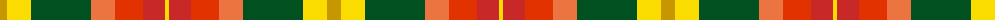

The parent of this is [Unidentified Silk Plaid #2](/tartans/dy/14/y24/g60/o24/ra28/r22/y/4/)

This was sourced from register-of-tartans.  It is a [7 stripes tartan](/stripes/stripes7/).

Original link https://www.tartanregister.gov.uk/tartanDetails.aspx?ref=4384

## Thread count
DY/14 Y24 G60 O24 Ra28 R22 Y/4

## Palette
Each colour and its ΔE from the base-6 reference it is a variant of.

| Colour | Shade | Base | ΔE (OKLab) |
|---|---|---|---|
| DY |  `#C89600` | Y  | 0.12 |
| G |  `#005020` | G  | 0.08 |
| O |  `#EC7440` | R  | 0.18 |
| R |  `#C82828` | R  | 0.03 |
| Ra |  `#E13200` | R  | 0.07 |
| Y |  `#FADC00` | Y  | 0.08 |

# Sample pattern

ID: /variants/dy/14/y24/g60/o24/ra28/r22/y/4-dyc89600-g005020-oec7440-rc82828-rae13200-yfadc00/
