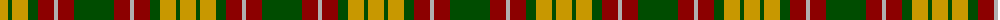
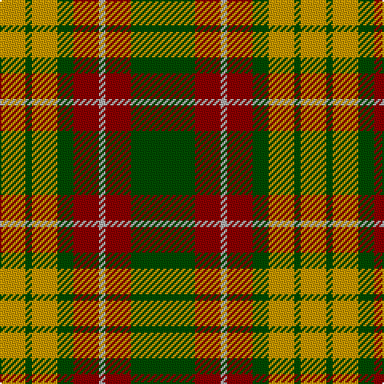

The parent of this is [Unidentified #57](/tartans/dy/16/g4/dy16/g10/dr16/n4/dr16/g/40/)

This was sourced from register-of-tartans.  It is a [8 stripes tartan](/stripes/stripes8/).

Original link https://www.tartanregister.gov.uk/tartanDetails.aspx?ref=4258

## Thread count
DY/16 G4 DY16 G10 DR16 N4 DR16 G/40

## Palette
Each colour and its ΔE from the base-6 reference it is a variant of.

| Colour | Shade | Base | ΔE (OKLab) |
|---|---|---|---|
| DR |  `#8C0000` | R  | 0.13 |
| DY |  `#C89800` | Y  | 0.12 |
| G |  `#004C00` | G  | 0.08 |
| N |  `#B0B0B0` | Y  | 0.18 |

# Sample pattern

ID: /variants/dy/16/g4/dy16/g10/dr16/n4/dr16/g/40-dr8c0000-dyc89800-g004c00-nb0b0b0/
