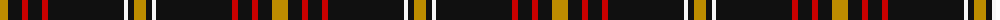

The parent of this is [Bunnahabhain (Corporate)](/tartans/dy/16/k14/r6/k14/r6/k76/w4/k6/dy/12/)

This was sourced from tartans-authority.  It is a [9 stripes tartan](/stripes/stripes9/).

Original link http://www.tartansauthority.com/tartan-ferret/display/6685/

## Thread count
DY/16 K14 R6 K14 R6 K76 W4 K6 DY/12

## Palette
Each colour and its ΔE from the base-6 reference it is a variant of.

| Colour | Shade | Base | ΔE (OKLab) |
|---|---|---|---|
| DY |  `#BC8C00` | Y  | 0.16 |
| K |  `#101010` | K  | 0.17 |
| R |  `#C80000` | R  | 0.00 |
| W |  `#F8F8F8` | W  | 0.01 |

ID: /variants/dy/16/k14/r6/k14/r6/k76/w4/k6/dy/12-dybc8c00-k101010-rc80000-wf8f8f8/
