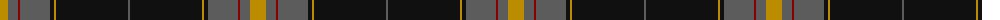
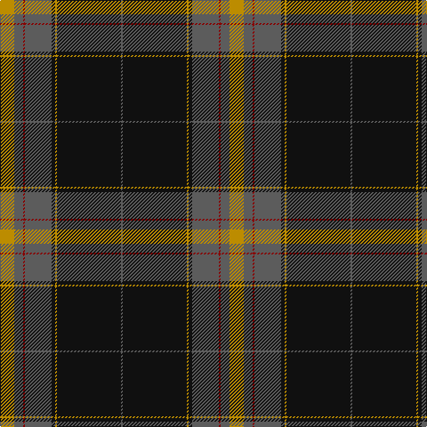

The parent of this is [Cirse 3D](/tartans/dy/16/n10/dr2/n30/k4/dy2/k72/n/2/)

This was sourced from tartans-authority.  It is a [8 stripes tartan](/stripes/stripes8/).

Original link http://www.tartansauthority.com/tartan-ferret/display/8803/

## Thread count
DY/16 N10 DR2 N30 K4 DY2 K72 N/2

## Palette
Each colour and its ΔE from the base-6 reference it is a variant of.

| Colour | Shade | Base | ΔE (OKLab) |
|---|---|---|---|
| DR |  `#880000` | R  | 0.14 |
| DY |  `#BC8C00` | Y  | 0.16 |
| K |  `#101010` | K  | 0.17 |
| N |  `#5C5C5C` | B  | 0.14 |

# Sample pattern

ID: /variants/dy/16/n10/dr2/n30/k4/dy2/k72/n/2-dr880000-dybc8c00-k101010-n5c5c5c/
