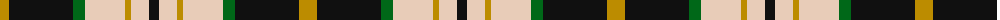
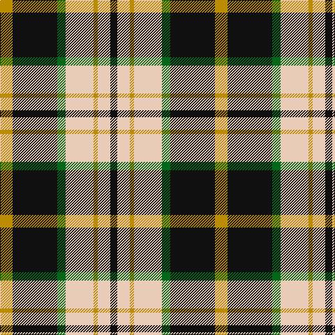

The parent of this is [Black & White Golf (Corporate)](/tartans/dy/18/k64/g12/lr40/dy6/lr18/k/10/)

This was sourced from tartans-authority.  It is a [7 stripes tartan](/stripes/stripes7/).

Original link http://www.tartansauthority.com/tartan-ferret/display/10782/

## Thread count
DY/18 K64 G12 LR40 DY6 LR18 K/10

## Palette
Each colour and its ΔE from the base-6 reference it is a variant of.

| Colour | Shade | Base | ΔE (OKLab) |
|---|---|---|---|
| DY |  `#BC8C00` | Y  | 0.16 |
| G |  `#006818` | G  | 0.02 |
| K |  `#101010` | K  | 0.17 |
| LR |  `#E8CCB8` | W  | 0.11 |

# Sample pattern

ID: /variants/dy/18/k64/g12/lr40/dy6/lr18/k/10-dybc8c00-g006818-k101010-lre8ccb8/
