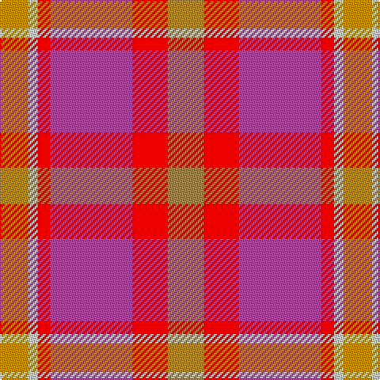

The parent of this is [Lady Boys of Bangkok (Corporate)](/tartans/dy/18/ln6/r8/p52/r22/lt/23/)

This was sourced from tartans-authority.  It is a [6 stripes tartan](/stripes/stripes6/).

Original link http://www.tartansauthority.com/tartan-ferret/display/7142/

## Thread count
DY/18 LN6 R8 P52 R22 LT/23

## Palette
Each colour and its ΔE from the base-6 reference it is a variant of.

| Colour | Shade | Base | ΔE (OKLab) |
|---|---|---|---|
| DY |  `#BC8C00` | Y  | 0.16 |
| LN |  `#E0E0E0` | W  | 0.06 |
| LT |  `#A08858` | Y  | 0.21 |
| P |  `#A45098` | R  | 0.18 |
| R |  `#C80000` | R  | 0.00 |

# Sample pattern

ID: /variants/dy/18/ln6/r8/p52/r22/lt/23-dybc8c00-lne0e0e0-lta08858-pa45098-rc80000/
