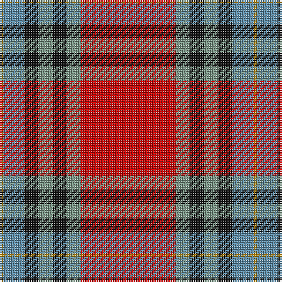

The parent of this is [MacLeay](/tartans/dy/2/b12/k8/lg8/k8/lg8/r/54/)

This was sourced from register-of-tartans.  It is a [7 stripes tartan](/stripes/stripes7/).

Original link https://www.tartanregister.gov.uk/tartanDetails.aspx?ref=5194

## Thread count
DY/2 B12 K8 LG8 K8 LG8 R/54

## Palette
Each colour and its ΔE from the base-6 reference it is a variant of.

| Colour | Shade | Base | ΔE (OKLab) |
|---|---|---|---|
| B |  `#5C8CA8` | B  | 0.23 |
| DY |  `#D09800` | Y  | 0.11 |
| K |  `#101010` | K  | 0.17 |
| LG |  `#789484` | G  | 0.23 |
| R |  `#C80000` | R  | 0.00 |

# Sample pattern

ID: /variants/dy/2/b12/k8/lg8/k8/lg8/r/54-b5c8ca8-dyd09800-k101010-lg789484-rc80000/
