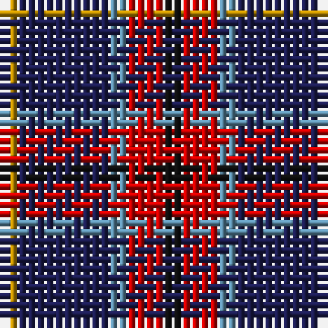

The parent of this is [Trinity College, Toronto Uni. (Corp](/tartans/dy/2/db10/b2/r4/k/2/)

This was sourced from tartans-authority.  It is a [5 stripes tartan](/stripes/stripes5/).

Original link http://www.tartansauthority.com/tartan-ferret/display/10211/

## Thread count
DY/2 DB10 B2 R4 K/2

## Palette
Each colour and its ΔE from the base-6 reference it is a variant of.

| Colour | Shade | Base | ΔE (OKLab) |
|---|---|---|---|
| B |  `#5C8CA8` | B  | 0.23 |
| DB |  `#1C1C50` | B  | 0.14 |
| DY |  `#BC8C00` | Y  | 0.16 |
| K |  `#101010` | K  | 0.17 |
| R |  `#C80000` | R  | 0.00 |

# Sample pattern

ID: /variants/dy/2/db10/b2/r4/k/2-b5c8ca8-db1c1c50-dybc8c00-k101010-rc80000/
