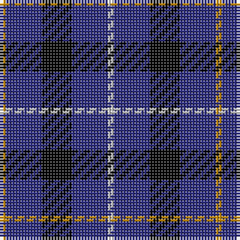

The parent of this is [Bank of Scotland (1995) (Corporate)](/tartans/dy/2/db12/k10/db12/n/2/)

This was sourced from tartans-authority.  It is a [5 stripes tartan](/stripes/stripes5/).

Original link http://www.tartansauthority.com/tartan-ferret/display/2462/

## Thread count
DY/2 DB12 K10 DB12 N/2

## Palette
Each colour and its ΔE from the base-6 reference it is a variant of.

| Colour | Shade | Base | ΔE (OKLab) |
|---|---|---|---|
| DB |  `#2C2C80` | B  | 0.05 |
| DY |  `#C88C00` | Y  | 0.15 |
| K |  `#000000` | K  | 0.00 |
| N |  `#C8C8C8` | W  | 0.13 |

# Sample pattern

ID: /variants/dy/2/db12/k10/db12/n/2-db2c2c80-dyc88c00-k000000-nc8c8c8/
