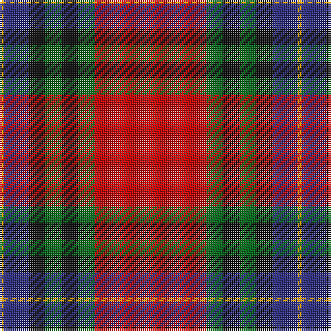

The parent of this is [MacLeay (Clan)](/tartans/dy/2/db12/k8/g8/k8/g8/r/54/)

This was sourced from tartans-authority.  It is a [7 stripes tartan](/stripes/stripes7/).

Original link http://www.tartansauthority.com/tartan-ferret/display/3437/

## Thread count
DY/2 DB12 K8 G8 K8 G8 R/54

## Palette
Each colour and its ΔE from the base-6 reference it is a variant of.

| Colour | Shade | Base | ΔE (OKLab) |
|---|---|---|---|
| DB |  `#2C2C80` | B  | 0.05 |
| DY |  `#D09800` | Y  | 0.11 |
| G |  `#006818` | G  | 0.02 |
| K |  `#101010` | K  | 0.17 |
| R |  `#C80000` | R  | 0.00 |

# Sample pattern

ID: /variants/dy/2/db12/k8/g8/k8/g8/r/54-db2c2c80-dyd09800-g006818-k101010-rc80000/
