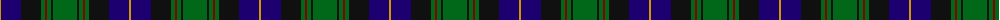
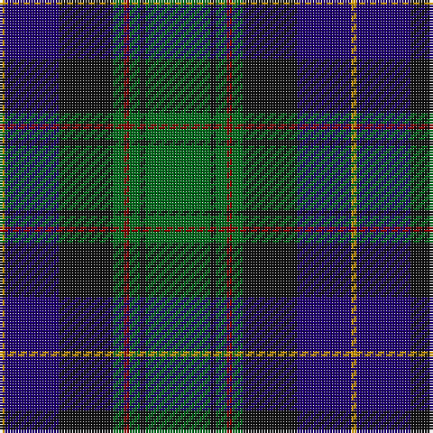

The parent of this is [Guelph, City Of (District)](/tartans/dy/2/db20/k20/g4/dr2/g4/k2/g/24/)

This was sourced from tartans-authority.  It is a [8 stripes tartan](/stripes/stripes8/).

Original link http://www.tartansauthority.com/tartan-ferret/display/2186/

## Thread count
DY/2 DB20 K20 G4 DR2 G4 K2 G/24

## Palette
Each colour and its ΔE from the base-6 reference it is a variant of.

| Colour | Shade | Base | ΔE (OKLab) |
|---|---|---|---|
| DB |  `#1C0070` | B  | 0.14 |
| DR |  `#880000` | R  | 0.14 |
| DY |  `#D09800` | Y  | 0.11 |
| G |  `#006818` | G  | 0.02 |
| K |  `#101010` | K  | 0.17 |

# Sample pattern

ID: /variants/dy/2/db20/k20/g4/dr2/g4/k2/g/24-db1c0070-dr880000-dyd09800-g006818-k101010/
