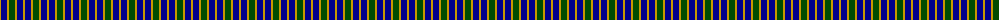

The parent of this is [Unidentified Printing #2](/tartans/dy/2/db6/dy2/g6/dy2/db6/dy2/db6/dy2/g/6/)

This was sourced from register-of-tartans.  It is a [10 stripes tartan](/stripes/stripes10/).

Original link https://www.tartanregister.gov.uk/tartanDetails.aspx?ref=4360

## Thread count
DY/2 DB6 DY2 G6 DY2 DB6 DY2 DB6 DY2 G/6

## Palette
Each colour and its ΔE from the base-6 reference it is a variant of.

| Colour | Shade | Base | ΔE (OKLab) |
|---|---|---|---|
| DB |  `#00008C` | B  | 0.13 |
| DY |  `#C89800` | Y  | 0.12 |
| G |  `#004C00` | G  | 0.08 |

ID: /variants/dy/2/db6/dy2/g6/dy2/db6/dy2/db6/dy2/g/6-db00008c-dyc89800-g004c00/
