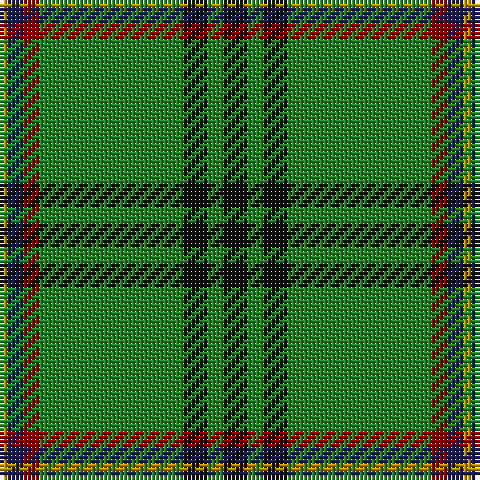

The parent of this is [Selvon-Bruce (Personal)](/tartans/dy/2/dba4/dra4/g36/k6/g4/k/6/)

This was sourced from register-of-tartans.  It is a [7 stripes tartan](/stripes/stripes7/).

Original link https://www.tartanregister.gov.uk/tartanDetails.aspx?ref=5592

## Thread count
DY/2 DBa4 DRa4 G36 K6 G4 K/6

## Palette
Each colour and its ΔE from the base-6 reference it is a variant of.

| Colour | Shade | Base | ΔE (OKLab) |
|---|---|---|---|
| DB |  `#2C2C80` | B  | 0.05 |
| DBa |  `#1C1C50` | B  | 0.14 |
| DR |  `#780028` | R  | 0.18 |
| DRa |  `#880000` | R  | 0.14 |
| DY |  `#BC8C00` | Y  | 0.16 |
| DYa |  `#D09800` | Y  | 0.11 |
| G |  `#288028` | G  | 0.09 |
| Ga |  `#006818` | G  | 0.02 |
| K |  `#101010` | K  | 0.17 |

# Sample pattern

ID: /variants/dy/2/dba4/dra4/g36/k6/g4/k/6-db2c2c80-dba1c1c50-dr780028-dra880000-dybc8c00-dyad09800-g288028-ga006818-k101010/
