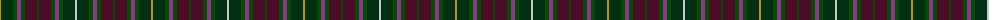

The parent of this is [Crosby (Personal)](/tartans/dy/2/dg12/g4/lp4/g4/dr12/g2/dr12/g4/lp4/g4/dg12/n/2/)

This was sourced from tartans-authority.  It is a [13 stripes tartan](/stripes/stripes13/).

Original link http://www.tartansauthority.com/tartan-ferret/display/4223/

## Thread count
DY/2 DG12 G4 LP4 G4 DR12 G2 DR12 G4 LP4 G4 DG12 N/2

## Palette
Each colour and its ΔE from the base-6 reference it is a variant of.

| Colour | Shade | Base | ΔE (OKLab) |
|---|---|---|---|
| DG |  `#003014` | G  | 0.18 |
| DR |  `#4C0C28` | B  | 0.19 |
| DY |  `#C88C00` | Y  | 0.15 |
| G |  `#004C00` | G  | 0.08 |
| LP |  `#903490` | B  | 0.18 |
| N |  `#C8C8C8` | W  | 0.13 |

ID: /variants/dy/2/dg12/g4/lp4/g4/dr12/g2/dr12/g4/lp4/g4/dg12/n/2-dg003014-dr4c0c28-dyc88c00-g004c00-lp903490-nc8c8c8/
