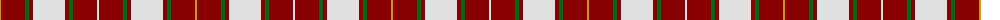

The parent of this is [MacFie Dress (Clan?)](/tartans/dy/2/dr24/g4/dr4/ln32/dr4/g4/dr24/ln/2/)

This was sourced from tartans-authority.  It is a [9 stripes tartan](/stripes/stripes9/).

Original link http://www.tartansauthority.com/tartan-ferret/display/4563/

## Thread count
DY/2 DR24 G4 DR4 LN32 DR4 G4 DR24 LN/2

## Palette
Each colour and its ΔE from the base-6 reference it is a variant of.

| Colour | Shade | Base | ΔE (OKLab) |
|---|---|---|---|
| DR |  `#880000` | R  | 0.14 |
| DY |  `#D09800` | Y  | 0.11 |
| G |  `#006818` | G  | 0.02 |
| LN |  `#E0E0E0` | W  | 0.06 |

ID: /variants/dy/2/dr24/g4/dr4/ln32/dr4/g4/dr24/ln/2-dr880000-dyd09800-g006818-lne0e0e0/
