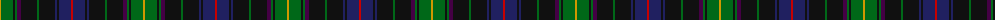

The parent of this is [van der Watt Personal)](/tartans/dy/2/g12/k2/g2/dp4/k16/g2/k16/db2/k2/db12/r/2/)

This was sourced from tartans-authority.  It is a [12 stripes tartan](/stripes/stripes12/).

Original link http://www.tartansauthority.com/tartan-ferret/display/8358/

## Thread count
DY/2 G12 K2 G2 DP4 K16 G2 K16 DB2 K2 DB12 R/2

## Palette
Each colour and its ΔE from the base-6 reference it is a variant of.

| Colour | Shade | Base | ΔE (OKLab) |
|---|---|---|---|
| DB |  `#202060` | B  | 0.11 |
| DP |  `#440044` | B  | 0.17 |
| DY |  `#D09800` | Y  | 0.11 |
| G |  `#006818` | G  | 0.02 |
| K |  `#101010` | K  | 0.17 |
| R |  `#C80000` | R  | 0.00 |

ID: /variants/dy/2/g12/k2/g2/dp4/k16/g2/k16/db2/k2/db12/r/2-db202060-dp440044-dyd09800-g006818-k101010-rc80000/
