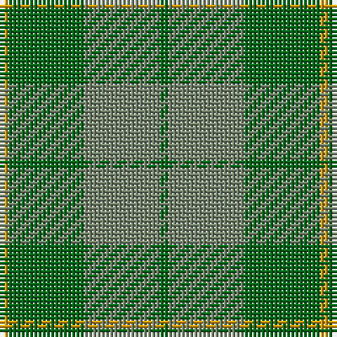

The parent of this is [Spring Morning (Fashion)](/tartans/dy/2/g18/n18/g/2/)

This was sourced from tartans-authority.  It is a [4 stripes tartan](/stripes/stripes4/).

Original link http://www.tartansauthority.com/tartan-ferret/display/5311/

## Thread count
DY/2 G18 N18 G/2

## Palette
Each colour and its ΔE from the base-6 reference it is a variant of.

| Colour | Shade | Base | ΔE (OKLab) |
|---|---|---|---|
| DY |  `#D09800` | Y  | 0.11 |
| G |  `#006818` | G  | 0.02 |
| N |  `#74846C` | G  | 0.19 |

# Sample pattern

ID: /variants/dy/2/g18/n18/g/2-dyd09800-g006818-n74846c/
