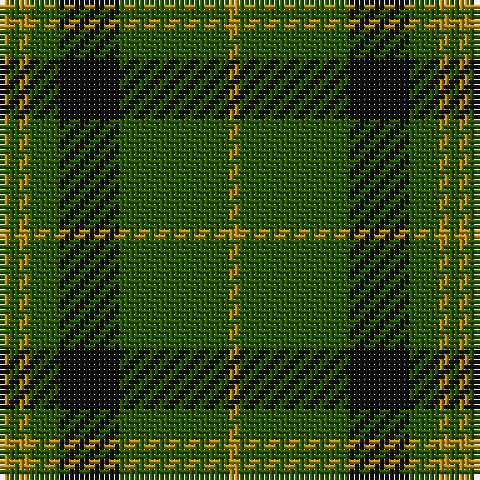

The parent of this is [Angle, Green (Fashion)](/tartans/dy/2/g2/dy2/g6/k12/g22/dy/2/)

This was sourced from tartans-authority.  It is a [7 stripes tartan](/stripes/stripes7/).

Original link http://www.tartansauthority.com/tartan-ferret/display/3514/

## Thread count
DY/2 G2 DY2 G6 K12 G22 DY/2

## Palette
Each colour and its ΔE from the base-6 reference it is a variant of.

| Colour | Shade | Base | ΔE (OKLab) |
|---|---|---|---|
| DY |  `#BC8C00` | Y  | 0.16 |
| G |  `#285800` | G  | 0.04 |
| K |  `#101010` | K  | 0.17 |

# Sample pattern

ID: /variants/dy/2/g2/dy2/g6/k12/g22/dy/2-dybc8c00-g285800-k101010/
