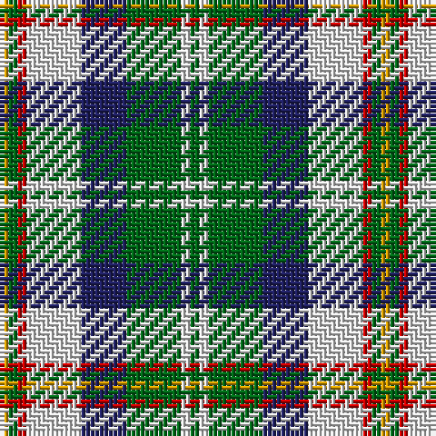

The parent of this is [Vermont Dress (US State)](/tartans/dy/2/g2/r2/ln12/db10/g12/ln2/g/2/)

This was sourced from tartans-authority.  It is a [8 stripes tartan](/stripes/stripes8/).

Original link http://www.tartansauthority.com/tartan-ferret/display/4348/

## Thread count
DY/2 G2 R2 LN12 DB10 G12 LN2 G/2

## Palette
Each colour and its ΔE from the base-6 reference it is a variant of.

| Colour | Shade | Base | ΔE (OKLab) |
|---|---|---|---|
| DB |  `#202060` | B  | 0.11 |
| DY |  `#D09800` | Y  | 0.11 |
| G |  `#006818` | G  | 0.02 |
| LN |  `#E0E0E0` | W  | 0.06 |
| R |  `#C80000` | R  | 0.00 |

# Sample pattern

ID: /variants/dy/2/g2/r2/ln12/db10/g12/ln2/g/2-db202060-dyd09800-g006818-lne0e0e0-rc80000/
