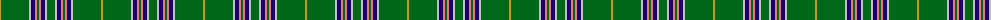

The parent of this is [Seattle (District)](/tartans/dy/2/g28/n2/db4/lr2/g2/lr2/db4/n2/g/8/)

This was sourced from tartans-authority.  It is a [10 stripes tartan](/stripes/stripes10/).

Original link http://www.tartansauthority.com/tartan-ferret/display/2113/

## Thread count
DY/2 G28 N2 DB4 LR2 G2 LR2 DB4 N2 G/8

## Palette
Each colour and its ΔE from the base-6 reference it is a variant of.

| Colour | Shade | Base | ΔE (OKLab) |
|---|---|---|---|
| DB |  `#1C0070` | B  | 0.14 |
| DY |  `#D09800` | Y  | 0.11 |
| G |  `#006818` | G  | 0.02 |
| LR |  `#E87878` | R  | 0.19 |
| N |  `#C0C0C0` | W  | 0.16 |

ID: /variants/dy/2/g28/n2/db4/lr2/g2/lr2/db4/n2/g/8-db1c0070-dyd09800-g006818-lre87878-nc0c0c0/
