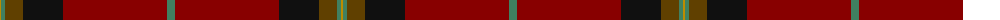

The parent of this is [Jack (Personal)](/tartans/dy/2/g4/t18/k40/dr104/g/8/)

This was sourced from tartans-authority.  It is a [6 stripes tartan](/stripes/stripes6/).

Original link http://www.tartansauthority.com/tartan-ferret/display/10719/

## Thread count
DY/2 G4 T18 K40 DR104 G/8

## Palette
Each colour and its ΔE from the base-6 reference it is a variant of.

| Colour | Shade | Base | ΔE (OKLab) |
|---|---|---|---|
| DR |  `#880000` | R  | 0.14 |
| DY |  `#BC8C00` | Y  | 0.16 |
| G |  `#408060` | G  | 0.13 |
| K |  `#101010` | K  | 0.17 |
| T |  `#604000` | G  | 0.14 |

# Sample pattern

ID: /variants/dy/2/g4/t18/k40/dr104/g/8-dr880000-dybc8c00-g408060-k101010-t604000/
