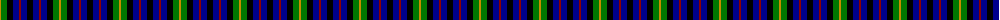
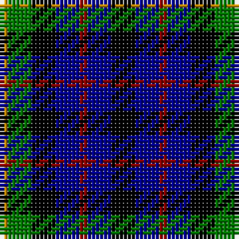

The parent of this is [Melrose of Alabama (Corporate)](/tartans/dy/2/g6/k6/db6/dr2/db6/k/6/)

This was sourced from tartans-authority.  It is a [7 stripes tartan](/stripes/stripes7/).

Original link http://www.tartansauthority.com/tartan-ferret/display/4151/

## Thread count
DY/2 G6 K6 DB6 DR2 DB6 K/6

## Palette
Each colour and its ΔE from the base-6 reference it is a variant of.

| Colour | Shade | Base | ΔE (OKLab) |
|---|---|---|---|
| DB |  `#00008C` | B  | 0.13 |
| DR |  `#8C0000` | R  | 0.13 |
| DY |  `#C88C00` | Y  | 0.15 |
| G |  `#007800` | G  | 0.06 |
| K |  `#000000` | K  | 0.00 |

# Sample pattern

ID: /variants/dy/2/g6/k6/db6/dr2/db6/k/6-db00008c-dr8c0000-dyc88c00-g007800-k000000/
