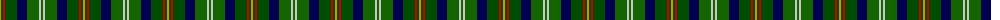
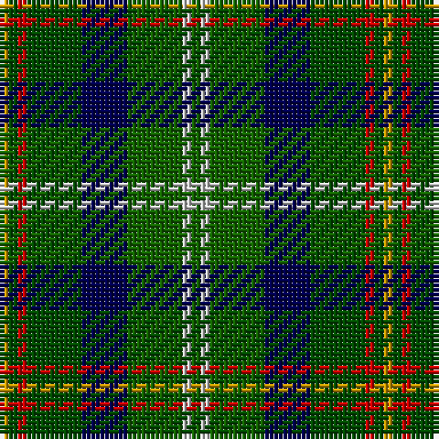

The parent of this is [Vermont](/tartans/dy/2/ga2/r2/ga12/db10/g12/n2/g/2/)

This was sourced from register-of-tartans.  It is a [8 stripes tartan](/stripes/stripes8/).

Original link https://www.tartanregister.gov.uk/tartanDetails.aspx?ref=4449

## Thread count
DY/2 Ga2 R2 Ga12 DB10 G12 N2 G/2

## Palette
Each colour and its ΔE from the base-6 reference it is a variant of.

| Colour | Shade | Base | ΔE (OKLab) |
|---|---|---|---|
| DB |  `#000050` | B  | 0.20 |
| DR |  `#8C0000` | R  | 0.13 |
| DY |  `#C89800` | Y  | 0.12 |
| G |  `#146400` | G  | 0.01 |
| Ga |  `#004C00` | G  | 0.08 |
| N |  `#C8C8C8` | W  | 0.13 |
| R |  `#C80000` | R  | 0.00 |

# Sample pattern

ID: /variants/dy/2/ga2/r2/ga12/db10/g12/n2/g/2-db000050-dr8c0000-dyc89800-g146400-ga004c00-nc8c8c8-rc80000/
