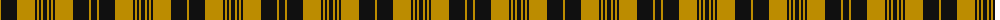

The parent of this is [Justus Black & Gold (Angus) (Personal)](/tartans/dy/2/k16/dy18/k2/dy2/k2/dy2/k4/dy2/k2/dy2/k2/dy18/k16/dy2/k/6/)

This was sourced from register-of-tartans.  It is a [16 stripes tartan](/stripes/stripes16/).

Original link https://www.tartanregister.gov.uk/tartanDetails.aspx?ref=1918

## Thread count
DY/2 K16 DY18 K2 DY2 K2 DY2 K4 DY2 K2 DY2 K2 DY18 K16 DY2 K/6

## Palette
Each colour and its ΔE from the base-6 reference it is a variant of.

| Colour | Shade | Base | ΔE (OKLab) |
|---|---|---|---|
| DY |  `#BC8C00` | Y  | 0.16 |
| K |  `#101010` | K  | 0.17 |
| Y |  `#E8C000` | Y  | 0.00 |
| Ya |  `#E8C000` | Y  | 0.00 |

ID: /variants/dy/2/k16/dy18/k2/dy2/k2/dy2/k4/dy2/k2/dy2/k2/dy18/k16/dy2/k/6-dybc8c00-k101010-ye8c000-yae8c000/
