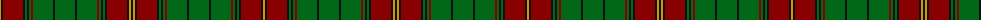

The parent of this is [Ulster (Red)](/tartans/dy/2/k2/dr20/k2/g2/k2/g2/dr2/g20/k2/g20/k2/g20/dr2/g2/k2/g2/k2/dr20/k2/dy2/k/2/)

This was sourced from register-of-tartans.  It is a [22 stripes tartan](/stripes/stripes22/).

Original link https://www.tartanregister.gov.uk/tartanDetails.aspx?ref=4197

## Thread count
DY/2 K2 DR20 K2 G2 K2 G2 DR2 G20 K2 G20 K2 G20 DR2 G2 K2 G2 K2 DR20 K2 DY2 K/2

## Palette
Each colour and its ΔE from the base-6 reference it is a variant of.

| Colour | Shade | Base | ΔE (OKLab) |
|---|---|---|---|
| DR |  `#880000` | R  | 0.14 |
| DY |  `#D09800` | Y  | 0.11 |
| G |  `#006818` | G  | 0.02 |
| K |  `#101010` | K  | 0.17 |

ID: /variants/dy/2/k2/dr20/k2/g2/k2/g2/dr2/g20/k2/g20/k2/g20/dr2/g2/k2/g2/k2/dr20/k2/dy2/k/2-dr880000-dyd09800-g006818-k101010/
