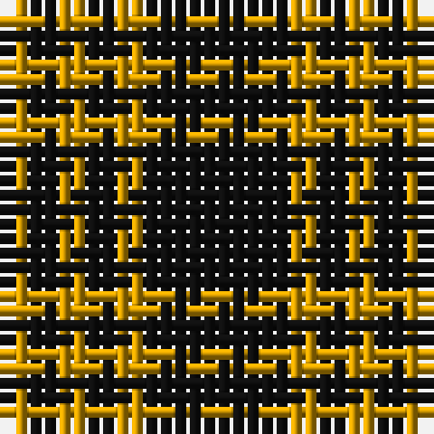

The parent of this is [Justus #2 (Personal)](/tartans/dy/2/k2/dy2/k2/dy2/k/10/)

This was sourced from register-of-tartans.  It is a [6 stripes tartan](/stripes/stripes6/).

Original link https://www.tartanregister.gov.uk/tartanDetails.aspx?ref=1917

## Thread count
DY/2 K2 DY2 K2 DY2 K/10

## Palette
Each colour and its ΔE from the base-6 reference it is a variant of.

| Colour | Shade | Base | ΔE (OKLab) |
|---|---|---|---|
| DY |  `#D09800` | Y  | 0.11 |
| K |  `#101010` | K  | 0.17 |

# Sample pattern

ID: /variants/dy/2/k2/dy2/k2/dy2/k/10-dyd09800-k101010/
