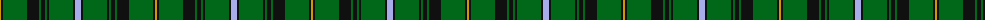

The parent of this is [MacCandlish Hunting Green](/tartans/dy/2/k2/g24/k12/g2/k4/g2/k2/g24/k2/lp/6/)

This was sourced from register-of-tartans.  It is a [11 stripes tartan](/stripes/stripes11/).

Original link https://www.tartanregister.gov.uk/tartanDetails.aspx?ref=5247

## Thread count
DY/2 K2 G24 K12 G2 K4 G2 K2 G24 K2 LP/6

## Palette
Each colour and its ΔE from the base-6 reference it is a variant of.

| Colour | Shade | Base | ΔE (OKLab) |
|---|---|---|---|
| DY |  `#D09800` | Y  | 0.11 |
| G |  `#006818` | G  | 0.02 |
| K |  `#101010` | K  | 0.17 |
| LP |  `#A8ACE8` | W  | 0.22 |

ID: /variants/dy/2/k2/g24/k12/g2/k4/g2/k2/g24/k2/lp/6-dyd09800-g006818-k101010-lpa8ace8/
