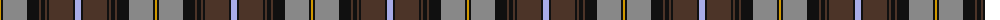

The parent of this is [MacCandlish Dress Grey](/tartans/dy/2/k2/n24/k12/t2/k4/t2/k2/t24/k2/lp/6/)

This was sourced from register-of-tartans.  It is a [11 stripes tartan](/stripes/stripes11/).

Original link https://www.tartanregister.gov.uk/tartanDetails.aspx?ref=5234

## Thread count
DY/2 K2 N24 K12 T2 K4 T2 K2 T24 K2 LP/6

## Palette
Each colour and its ΔE from the base-6 reference it is a variant of.

| Colour | Shade | Base | ΔE (OKLab) |
|---|---|---|---|
| DY |  `#D09800` | Y  | 0.11 |
| K |  `#101010` | K  | 0.17 |
| LP |  `#A8ACE8` | W  | 0.22 |
| N |  `#888888` | R  | 0.24 |
| T |  `#4C3428` | B  | 0.16 |

ID: /variants/dy/2/k2/n24/k12/t2/k4/t2/k2/t24/k2/lp/6-dyd09800-k101010-lpa8ace8-n888888-t4c3428/
