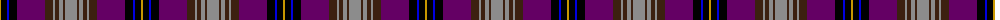

The parent of this is [Wcwm 1873-4](/tartans/dy/2/ka6/b2/ka8/p28/k8/n2/k4/n4/k2/n/12/)

This was sourced from register-of-tartans.  It is a [11 stripes tartan](/stripes/stripes11/).

Original link https://www.tartanregister.gov.uk/tartanDetails.aspx?ref=4545

## Thread count
DY/2 Ka6 B2 Ka8 P28 K8 N2 K4 N4 K2 N/12

## Palette
Each colour and its ΔE from the base-6 reference it is a variant of.

| Colour | Shade | Base | ΔE (OKLab) |
|---|---|---|---|
| B |  `#0000E0` | B  | 0.17 |
| DY |  `#C89800` | Y  | 0.12 |
| K |  `#3C2010` | B  | 0.20 |
| Ka |  `#000000` | K  | 0.00 |
| N |  `#8C8C8C` | R  | 0.24 |
| P |  `#640064` | B  | 0.15 |

ID: /variants/dy/2/ka6/b2/ka8/p28/k8/n2/k4/n4/k2/n/12-b0000e0-dyc89800-k3c2010-ka000000-n8c8c8c-p640064/
