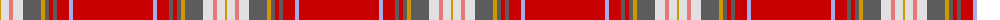

The parent of this is [Rathmore (Fashion)](/tartans/dy/2/ln8/lr4/ln10/n18/dy4/n4/r4/n4/r12/lp4/r/80/)

This was sourced from tartans-authority.  It is a [12 stripes tartan](/stripes/stripes12/).

Original link http://www.tartansauthority.com/tartan-ferret/display/1518/

## Thread count
DY/2 LN8 LR4 LN10 N18 DY4 N4 R4 N4 R12 LP4 R/80

## Palette
Each colour and its ΔE from the base-6 reference it is a variant of.

| Colour | Shade | Base | ΔE (OKLab) |
|---|---|---|---|
| DY |  `#D09800` | Y  | 0.11 |
| LN |  `#E0E0E0` | W  | 0.06 |
| LP |  `#A8ACE8` | W  | 0.22 |
| LR |  `#E87878` | R  | 0.19 |
| N |  `#5C5C5C` | B  | 0.14 |
| R |  `#C80000` | R  | 0.00 |

ID: /variants/dy/2/ln8/lr4/ln10/n18/dy4/n4/r4/n4/r12/lp4/r/80-dyd09800-lne0e0e0-lpa8ace8-lre87878-n5c5c5c-rc80000/
