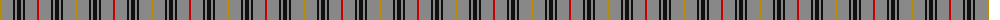

The parent of this is [Mowdowny (Fashion)](/tartans/dy/2/n12/k2/n2/k4/n2/k2/n12/r/2/)

This was sourced from tartans-authority.  It is a [9 stripes tartan](/stripes/stripes9/).

Original link http://www.tartansauthority.com/tartan-ferret/display/3880/

## Thread count
DY/2 N12 K2 N2 K4 N2 K2 N12 R/2

## Palette
Each colour and its ΔE from the base-6 reference it is a variant of.

| Colour | Shade | Base | ΔE (OKLab) |
|---|---|---|---|
| DY |  `#BC8C00` | Y  | 0.16 |
| K |  `#101010` | K  | 0.17 |
| N |  `#888888` | R  | 0.24 |
| R |  `#C80000` | R  | 0.00 |

ID: /variants/dy/2/n12/k2/n2/k4/n2/k2/n12/r/2-dybc8c00-k101010-n888888-rc80000/
