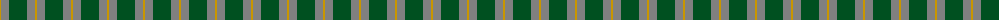
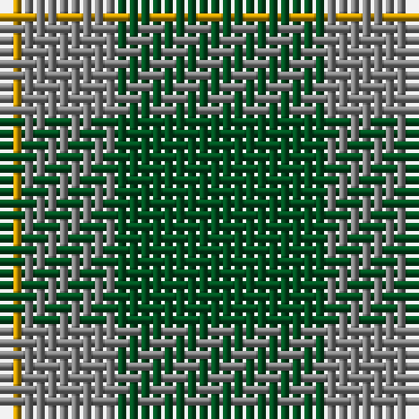

The parent of this is [Ledford](/tartans/dy/2/n8/g/18/)

This was sourced from register-of-tartans.  It is a [3 stripes tartan](/stripes/stripes3/).

Original link https://www.tartanregister.gov.uk/tartanDetails.aspx?ref=2079

## Thread count
DY/2 N8 G/18

## Palette
Each colour and its ΔE from the base-6 reference it is a variant of.

| Colour | Shade | Base | ΔE (OKLab) |
|---|---|---|---|
| DY |  `#C89600` | Y  | 0.12 |
| G |  `#005020` | G  | 0.08 |
| N |  `#808080` | G  | 0.22 |

# Sample pattern

ID: /variants/dy/2/n8/g/18-dyc89600-g005020-n808080/
