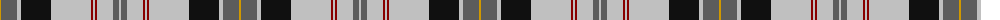

The parent of this is [Harris (Personal)](/tartans/dy/2/na16/n4/k30/n40/dr2/n2/dr2/n16/na6/n/2/)

This was sourced from tartans-authority.  It is a [11 stripes tartan](/stripes/stripes11/).

Original link http://www.tartansauthority.com/tartan-ferret/display/5159/

## Thread count
DY/2 Na16 N4 K30 N40 DR2 N2 DR2 N16 Na6 N/2

## Palette
Each colour and its ΔE from the base-6 reference it is a variant of.

| Colour | Shade | Base | ΔE (OKLab) |
|---|---|---|---|
| DR |  `#880000` | R  | 0.14 |
| DY |  `#D09800` | Y  | 0.11 |
| K |  `#101010` | K  | 0.17 |
| N |  `#C0C0C0` | W  | 0.16 |
| Na |  `#5C5C5C` | B  | 0.14 |

ID: /variants/dy/2/na16/n4/k30/n40/dr2/n2/dr2/n16/na6/n/2-dr880000-dyd09800-k101010-nc0c0c0-na5c5c5c/
