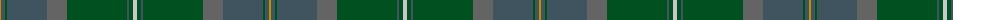

The parent of this is [Scottish Borderland (Fashion)](/tartans/dy/2/na4/g2/na40/nb20/g60/na2/g4/n/4/)

This was sourced from tartans-authority.  It is a [9 stripes tartan](/stripes/stripes9/).

Original link http://www.tartansauthority.com/tartan-ferret/display/5359/

## Thread count
DY/2 Na4 G2 Na40 Nb20 G60 Na2 G4 N/4

## Palette
Each colour and its ΔE from the base-6 reference it is a variant of.

| Colour | Shade | Base | ΔE (OKLab) |
|---|---|---|---|
| DY |  `#C88C00` | Y  | 0.15 |
| G |  `#005020` | G  | 0.08 |
| N |  `#C8C8C8` | W  | 0.13 |
| Na |  `#405460` | B  | 0.10 |
| Nb |  `#646464` | B  | 0.16 |

ID: /variants/dy/2/na4/g2/na40/nb20/g60/na2/g4/n/4-dyc88c00-g005020-nc8c8c8-na405460-nb646464/
