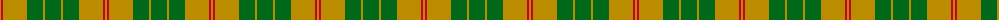
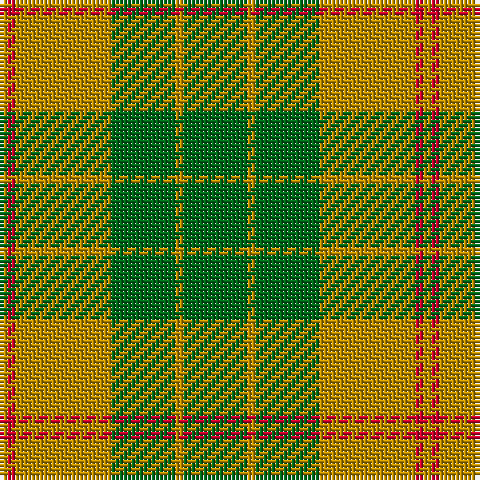

The parent of this is [Forget Family (Personal)](/tartans/dy/2/r2/dy24/g16/dy2/g/16/)

This was sourced from tartans-authority.  It is a [6 stripes tartan](/stripes/stripes6/).

Original link http://www.tartansauthority.com/tartan-ferret/display/10694/

## Thread count
DY/2 R2 DY24 G16 DY2 G/16

## Palette
Each colour and its ΔE from the base-6 reference it is a variant of.

| Colour | Shade | Base | ΔE (OKLab) |
|---|---|---|---|
| DY |  `#BC8C00` | Y  | 0.16 |
| G |  `#006818` | G  | 0.02 |
| R |  `#C8002C` | R  | 0.03 |

# Sample pattern

ID: /variants/dy/2/r2/dy24/g16/dy2/g/16-dybc8c00-g006818-rc8002c/
