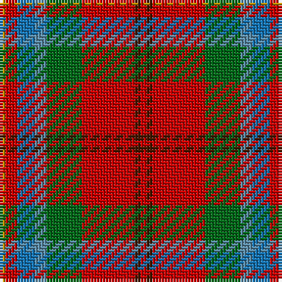

The parent of this is [Battle of Bannockburn, The](/tartans/dy/2/r4/ba6/b4/g12/r18/dr2/r/2/)

This was sourced from tartans-authority.  It is a [8 stripes tartan](/stripes/stripes8/).

Original link http://www.tartansauthority.com/tartan-ferret/display/10788/

## Thread count
DY/2 R4 Ba6 B4 G12 R18 DR2 R/2

## Palette
Each colour and its ΔE from the base-6 reference it is a variant of.

| Colour | Shade | Base | ΔE (OKLab) |
|---|---|---|---|
| B |  `#5C8CA8` | B  | 0.23 |
| Ba |  `#1474B4` | B  | 0.15 |
| DR |  `#441800` | B  | 0.22 |
| DY |  `#BC8C00` | Y  | 0.16 |
| G |  `#006818` | G  | 0.02 |
| R |  `#C80000` | R  | 0.00 |

# Sample pattern

ID: /variants/dy/2/r4/ba6/b4/g12/r18/dr2/r/2-b5c8ca8-ba1474b4-dr441800-dybc8c00-g006818-rc80000/
