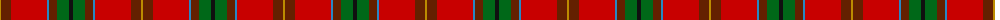
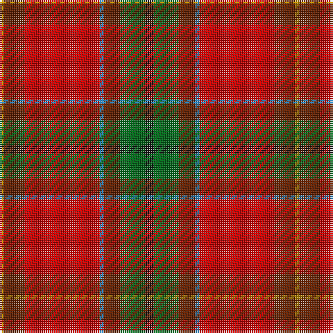

The parent of this is [Snelgrove (Name)](/tartans/dy/2/t10/r36/b2/t8/g12/k/4/)

This was sourced from tartans-authority.  It is a [7 stripes tartan](/stripes/stripes7/).

Original link http://www.tartansauthority.com/tartan-ferret/display/7803/

## Thread count
DY/2 T10 R36 B2 T8 G12 K/4

## Palette
Each colour and its ΔE from the base-6 reference it is a variant of.

| Colour | Shade | Base | ΔE (OKLab) |
|---|---|---|---|
| B |  `#2888C4` | B  | 0.21 |
| DY |  `#BC8C00` | Y  | 0.16 |
| G |  `#006818` | G  | 0.02 |
| K |  `#101010` | K  | 0.17 |
| R |  `#C80000` | R  | 0.00 |
| T |  `#642000` | B  | 0.21 |

# Sample pattern

ID: /variants/dy/2/t10/r36/b2/t8/g12/k/4-b2888c4-dybc8c00-g006818-k101010-rc80000-t642000/
