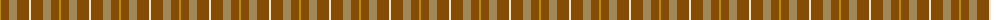
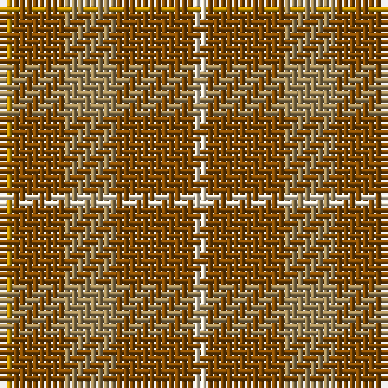

The parent of this is [Amber Rose (Fashion)](/tartans/dy/2/t8/lt8/t12/w/2/)

This was sourced from tartans-authority.  It is a [5 stripes tartan](/stripes/stripes5/).

Original link http://www.tartansauthority.com/tartan-ferret/display/8111/

## Thread count
DY/2 T8 LT8 T12 W/2

## Palette
Each colour and its ΔE from the base-6 reference it is a variant of.

| Colour | Shade | Base | ΔE (OKLab) |
|---|---|---|---|
| DY |  `#BC8C00` | Y  | 0.16 |
| LT |  `#A08858` | Y  | 0.21 |
| T |  `#844C04` | R  | 0.15 |
| W |  `#F0E4CC` | W  | 0.05 |

# Sample pattern

ID: /variants/dy/2/t8/lt8/t12/w/2-dybc8c00-lta08858-t844c04-wf0e4cc/
